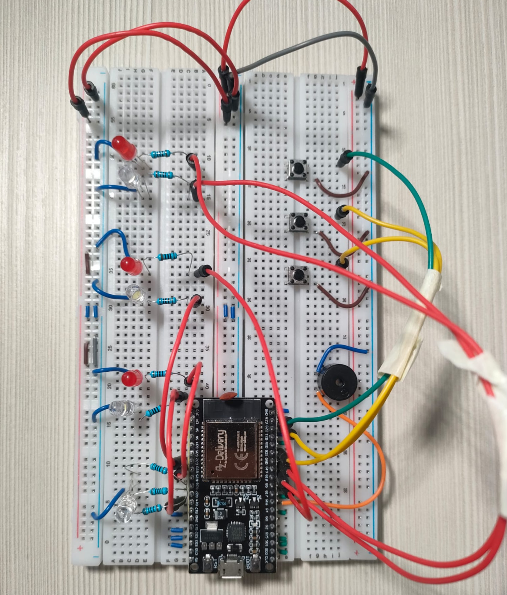

# 🕒 MorseAlarm - Sveglia Interattiva Morse

Progetto basato su **ESP32** che sfida l'utente a risolvere un codice Morse generato casualmente per spegnere l'allarme.

## 🛠️ Componenti principali
* **Microcontrollore:** ESP32 DevKit V1
* **Input:** Pulsanti per Punto, Linea e Invio
* **Feedback:** LED Rossi (sfida), LED Bianchi (progressi), Buzzer e LED RGB (stato WiFi)

## 📸 Foto del Progetto

## 🚀 Funzionalità
1. **Configurazione Web:** Impostazione orario tramite interfaccia WiFi.
2. **Sincronizzazione NTP:** Orario preciso tramite server it.pool.ntp.org.
3. **Logica Antirimbalzo:** Gestione avanzata dei pulsanti (Debouncing).
4. **Asincronia:** Uso di `millis()` per non bloccare il Web Server durante l'allarme.
